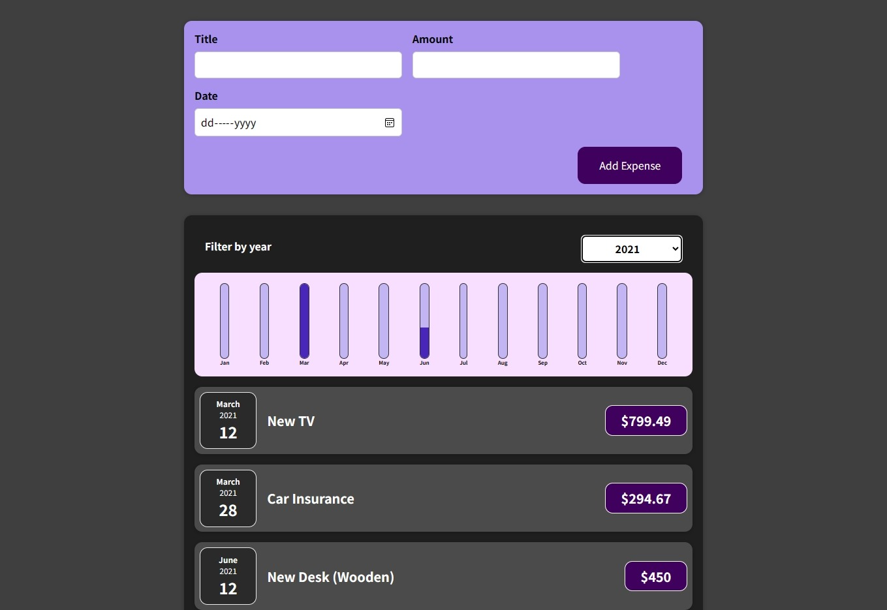

# Expense Tracker App

This React.js application allows users to manage their expenses, including adding new expenses, viewing a list of expenses, and filtering expenses by year.

## Table of Contents

- [Overview](#overview)
- [Components](#components)
- [Usage](#usage)
- [Preview](#preview)
- [Contributing](#contributing)
- [Contact Me](#contact-me)

## Overview

The Expense Tracker App consists of several components, each serving a specific purpose:

- **App:** The main component managing the state of expenses and rendering the application layout.
- **Expenses:** A component displaying a list of expenses and providing filtering options.
- **NewExpense:** A component for adding new expenses.
- **ExpenseList:** A list component rendering individual expense items.
- **ExpensesChart:** A component displaying a chart representation of monthly expenses.
- **Chart:** A generic chart component for displaying data points.
- **ChartBar:** A bar component within the chart.

## Components

### App Component (`App.js`)

The main component managing the state and rendering child components.

### Expenses Component (`Expenses.js`)

Displays a list of expenses and allows filtering by year.

### NewExpense Component (`NewExpense.js`)

Provides a form for adding new expenses.

### ExpenseList Component (`ExpenseList.js`)

Renders a list of individual expense items.

### ExpensesChart Component (`ExpensesChart.js`)

Displays a chart representation of monthly expenses.

### Chart Component (`Chart.js`)

A generic chart component for displaying data points.

### ChartBar Component (`ChartBar.js`)

A bar component within the chart.

## Usage

1. Clone the repository:

   ```bash
   git clone https://github.com/Adhamxiii/expense-tracker-app.git
   ```

2. Change into the project directory:

    ```bash
    cd expense-tracker-app
    ```

3. Install dependencies:

    ```bash
    npm install
    ```

4. Start the development server:

    ```bash
    npm start
    ```

5. Open your browser and visit `http://localhost:3000`.

6. Use the app to manage your expenses.

## Preview


## Contributing

Contributions are welcome! If you find any issues or have suggestions for improvements, please open an issue or submit a pull request.

## Contact Me

If you have any questions or suggestions, feel free to contact me:

- GitHub: [Adham Nasser](https://github.com/Adhamxiii)
- Linkedin: [Adham Nasser](https://www.linkedin.com/in/adhamnasser/)
